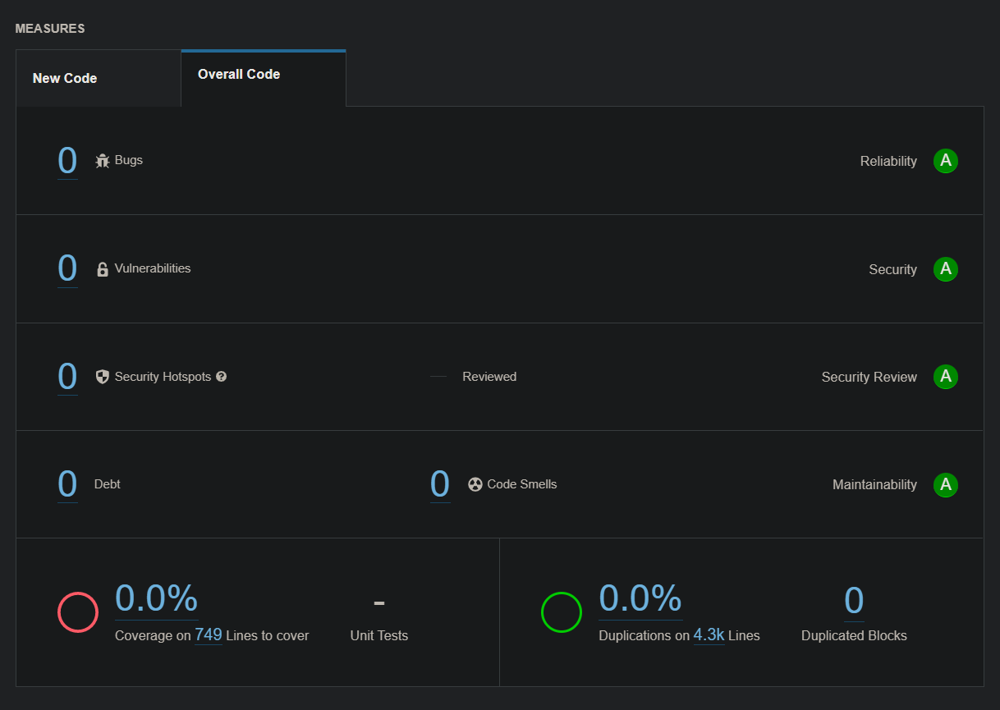

# ✈🗼 Explore Landmarks 🗼✈

https://user-images.githubusercontent.com/28221219/153501727-1f12efa2-10d2-4117-b56f-e58780cf62b7.mp4

## Screenshots

<table>
<tr>
<td>

</td>

<td>

</td>

<td>

</td>

<td>

</td></tr>

<tr>
<td>

</td>

<td>

</td>

<td>

</td>

<td>

</td></tr>

</table>

## 📔 Introduction

Explore Landmarks is a reference application for HMS Kits to phones running with the android based
HMS Service. Explore Landmark app is provides you to learn more information about the landmark
detected from an image given by you. It scans your image and recognizes landmark that exists in the
image. After that, the app gives you information about the landmark. And also it provides you to
view panoramic images and panoramic videos about the landmark. Additionally, the app provides an
image gallery that contains a lot of images related to the recognized landmark from the image given
by you. With all of these features, the app provides you to an authentication feature, too. With
this feature, you can share your saved credentials with other trusted apps or platforms. You can
retrieve saved credentials and delete them if you want.

## 🡻 Download 

# 📱 Features

### 🔑🔐 Sharing & Managing Credentials

-----
Thanks to [Huawei Keyring Service](https://developer.huawei.com/consumer/en/hms/huawei-keyring/) you
can list, save, delete and share user credentials in this app. Keyring offers the Credentials
Management API for storing user credentials locally on Android phones and tablets and sharing them
between different apps and different platform versions of an app. For understanding how keyring is
used in this app you can look at Authentication Fragment and related classes with it.

https://user-images.githubusercontent.com/28221219/153600393-b7cbb8b4-f5c8-4d14-8fa0-85dd13ccd1b0.mp4

### 🔎 Landmark Recognition

-----
Thanks to [Huawei Machine Learning](https://developer.huawei.com/consumer/en/hms/huawei-mlkit/) you
can recognize landmarks into images by this app. You have an image related to a landmark and do you
forget the name of the landmark? Okay, no problem just take a photo of the image and learn the
landmark information. Are you on travel and do you want to learn more information about the landmark
of you visiting? Okay just take a picture of the landmark and learn the landmark information. Also,
you can learn the landmark information by choosing an image that contains a landmark from the
gallery.

https://user-images.githubusercontent.com/28221219/153600544-e226e046-7bc1-441c-ac73-7b4bc4f7efe1.mp4

### 📄 Landmark Detail - Information

-----
You can see the recognized landmark information on this screen. And you can navigate to some screens
related to the landmark. You can see details of these landmarks in this repo: The Eiffel Tower, The
Sydney Opera House, The Burj Khalifa, The Kabah. When you try the repo please attention to that. Try
these landmarks if you want to learn detail about the landmarks.

### 🖼 📹 Panoramic Image and Video

-----
Thanks to [Huawei Panorama Kit](https://developer.huawei.com/consumer/en/hms/huawei-panoramakit/)
you can view panoramic images and panoramic videos of the landmarks in this app. There are 2
panoramic images each of The Eiffel Tower, The Sydney Opera House, The Burj Khalifa, The Kabah in
this repo.

https://user-images.githubusercontent.com/28221219/153600727-82f95d3d-a42c-4810-aca8-2b7ab8849664.mp4

There is 1 panoramic video each of The Eiffel Tower and The Burj Khalifa in this repo.

https://user-images.githubusercontent.com/28221219/153600784-adfa0865-bcfa-4be5-8cd7-bb001452ccf5.mp4

### 🖼 Image Gallery

-----
Thanks to [Huawei Search Kit](https://developer.huawei.com/consumer/en/hms/huawei-searchkit/) you
can view more images of the recognized landmark in this app. No any landmark limitations such as
Panorama Screen or Detail Screen in this feature. You can view more images (with nice animations) of
any recognized landmark on this screen.

https://user-images.githubusercontent.com/28221219/153601390-276fc684-f17f-4de7-8d81-c3cc0b946c91.mp4

## 💻 Tech Stack & Used Kits

Explore Landmarks app is designed with MVVM (Model-View-Viewmodel), Repository design patterns and
Kotlin is used for development.

### Used Kits

✅ [HUAWEI KEYRING SERVICE](https://developer.huawei.com/consumer/en/hms/huawei-keyring/) \
✅ [HUAWEI MACHINE LEARNING KIT](https://developer.huawei.com/consumer/en/hms/huawei-mlkit/)     \
✅ [HUAWEI PANORAMA KIT](https://developer.huawei.com/consumer/en/hms/huawei-panoramakit/)     \
✅ [HUAWEI SEARCH KIT](https://developer.huawei.com/consumer/en/hms/huawei-searchkit/)     \
✅ [HUAWEI ANALYTICS KIT](https://developer.huawei.com/consumer/en/hms/huawei-analyticskit)     \
✅ [HUAWEI APP GALLERY CONNECT CRASH SERVICE](https://developer.huawei.com/consumer/en/agconnect/crash/)

### Tech Stack

✅ [Hilt (DI)](https://developer.android.com/training/dependency-injection/hilt-android)     \
✅ [Architecture Components (DataBinding, ViewModel, LiveData)](https://developer.android.com/topic/libraries/architecture/viewmodel)     \
✅ [Coroutines](https://developer.android.com/kotlin/coroutines)     \
✅ [Jetpack Navigation component](https://developer.android.com/guide/navigation)     \
✅ [Airbnb Lottie](https://github.com/airbnb/lottie-android)     \
✅ [Facebook Shimmer](https://github.com/facebook/shimmer-android)     \
✅ [KenBurnsView](https://github.com/flavioarfaria/KenBurnsView)     \
✅ [Glide](https://github.com/bumptech/glide)     \
✅ [Scrolling Pager Indicator](https://github.com/Tinkoff/ScrollingPagerIndicator)

## ❓ Let's Try the App - What You Will Need

- A computer that can run Android Studio 😊.
- An android device with Hms Core installed and OS version Android 7 or higher (minSdk is API 24)
- Fork this repo by clicking top right and clone it to your computer.
- You need to AGConnect-Services.json file to run this project properly. Follow the below steps to
  obtain it.
  - [Create Huawei Developer Account if you haven't got an account](https://developer.huawei.com/consumer/en/doc/start/10104)
  - Go to the app-level build.gradle file and change the application id of the project. (You don't need to change the package name in the whole repo.)
  - [Create a SignIn Certificate with key0 alias, ExploreLandmarks password and named as ExploreLandmarks.jks](https://medium.com/@corruptedkernel/android-creating-a-signing-certificate-keystore-and-signing-your-apk-fa67fdd27cf)
    . Actually this password and alias are not mandatory but if you want to sign with different
    alias or password please don't forget to change needed information in build.gradle (app:level)
    to with new information. Replace this file with ExploreLandmarks.jks which already exist on the
    app directory.
  - [Generate SHA-256 Fingerprint via Keytool](https://medium.com/@corruptedkernel/android-generating-fingerprint-from-a-keystore-jks-file-b624bacd90fd)
    or running the signingReport task (View => Tool Windows => Gradle => Tasks => Android =>
    signingReport)
  - Login to [Huawei Developer Console](https://developer.huawei.com/consumer/en/console) if you
    didn't log in.
  - [Create a new  app with the new applicationId in AppGallery and integrate the repo with it](https://medium.com/huawei-developers/android-integrating-your-apps-with-huawei-hms-core-1f1e2a090e98) (
    Creating an app, adding SHA-256 to AppGallery Connect, Downloading AgConnectServices.json file)
  - Before downloading agconnect-services.json choose a Data Processing Location on Project Settings
    -> General Information (I recommended Germany because I use it and the search feature is worked
    properly with it.).
  - Before downloading and moving agconnect-services.json file to the "app" folder,
    please [make enable necessary services](https://developer.huawei.com/consumer/en/doc/distribution/app/agc-help-enabling-service-0000001146598793)
    . For this project you have to set enable Auth Service, Account Kit, ML Kit, Search Kit, Keyring
    Service, Analytics Kit.
- You need to client id and client secret to obtain an access token from Account Kit via OAuth-based
  authentication. [Get this information](https://developer.huawei.com/consumer/en/doc/distribution/app/agc-help-appinfo-0000001100014694)
  under Project Settings => General Information => App information => OAuth 2.0 client ID section
  and add them into app level build.gradle file.
- [You need to app id for Search Kit](https://developer.huawei.com/consumer/en/doc/development/HMSCore-Guides/integrating-sdk-0000001057023645)
  . Take the "app_id" value from the agconnect-services.json file and set it to the AGC_APP_ID_VALUE
  value in the application level build.gradle file.
- [You need to add the API key for using ML Kit on cloud services](https://developer.huawei.com/consumer/en/doc/development/hiai-Guides/add-appgallery-0000001050038080)
  Take the "api_key" value from the agconnect-services.json file and set it to the API_KEY_VALUE
  value in the application level build.gradle file.
- Solution of some issues you might be faced
  - Error Code 907135000 : Please move agconnect-services.json file under to app directory.
  - Error Code 6003 : [Enable App Signing by choosing "Let AppGallery Connect create and manage app signature for me"](https://developer.huawei.com/consumer/en/doc/development/AppGallery-connect-Guides/agc-appsigning-newapp-0000001052418290)

## Sonarqube Report ✅ Passed 🥳

## Licence

     Licensed under the Apache License, Version 2.0 (the "License");
    you may not use this file except in compliance with the License.
    You may obtain a copy of the License at

       http://www.apache.org/licenses/LICENSE-2.0

    Unless required by applicable law or agreed to in writing, software
    distributed under the License is distributed on an "AS IS" BASIS,
    WITHOUT WARRANTIES OR CONDITIONS OF ANY KIND, either express or implied.
    See the License for the specific language governing permissions and
    limitations under the License.
